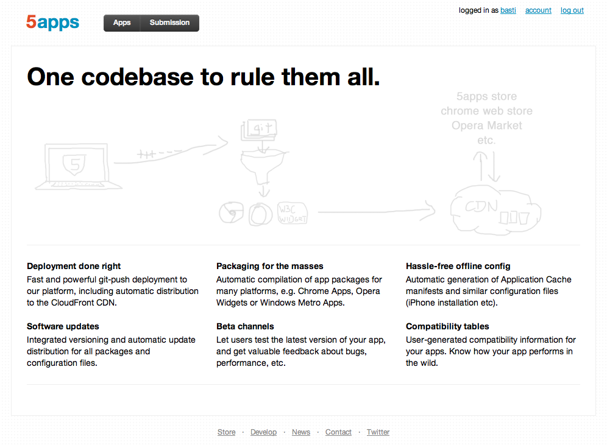
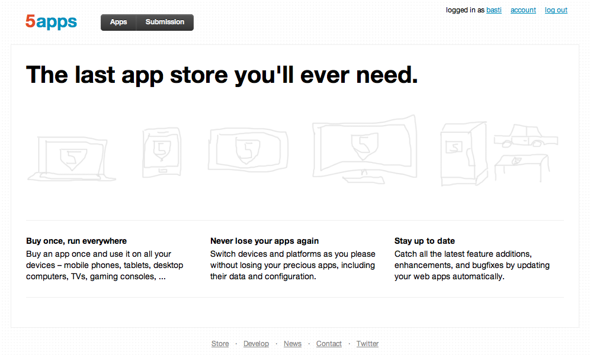

## A short introduction to 5apps

(Quick sketch, only bullet points for now)

### The Problem

* Computing becomes cheaper and more ubiquitous by the day, bringing an immense variety of platforms and devices.
* Most platforms today use proprietary development and distribution environments, forcing both users to stay on their platform, as well as developers to build apps for either only their platform or multiple platforms in parallel.

### The Outlook

* However, even with successful app-store models in place, most vendors are also preparing for the future by developing and adopting countless new and existing web standards to make cross-platform development and distribution feasible in the long run.
* Everybody is agreeing on the Open Web Platform (meaning HTMl5, JavaScript, and friends) to become at least an equal option for software development in the future.
* Development on those standards is going fast, as is adoption. Not only on desktop and mobile, but even on gaming consoles and TVs, with many more devices being in the offing.

### Vision

* Write an app once (i.e. use only one codebase and technology set), distribute it to all possible platforms.
* Buy an app once, run it on all possible devices, no matter what operating system they run on. Never lose that app again.

### Solution

* Developing a service platform that makes it both easy for developers to deploy, distribute and sell their web apps, as well as for users to purchase, access, use, and backup them.

A rough overview of that solution can be seen on the working drafts for our teaser pages (that are also just rough sketches, using touchpad-painted concept graphics and quick lists of what we deem important):

#### Deployment platform

#### App Store

